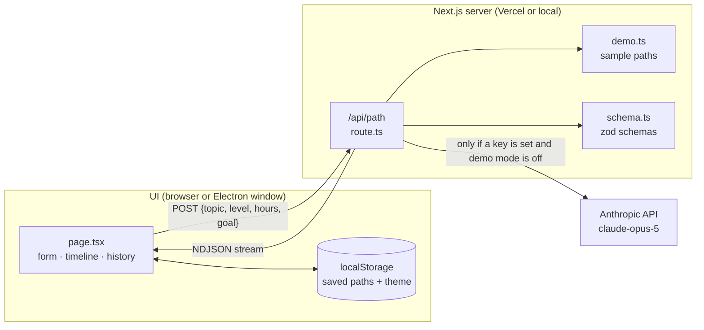
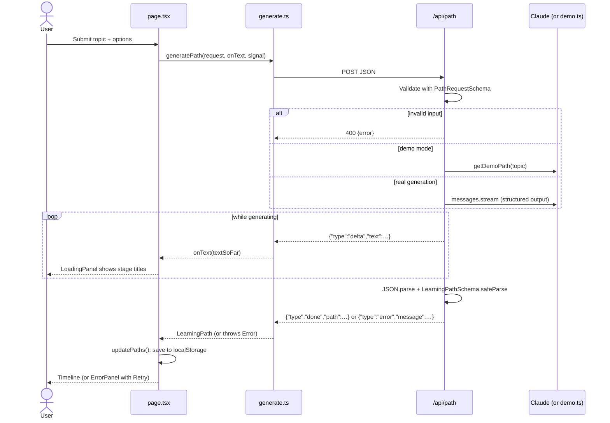
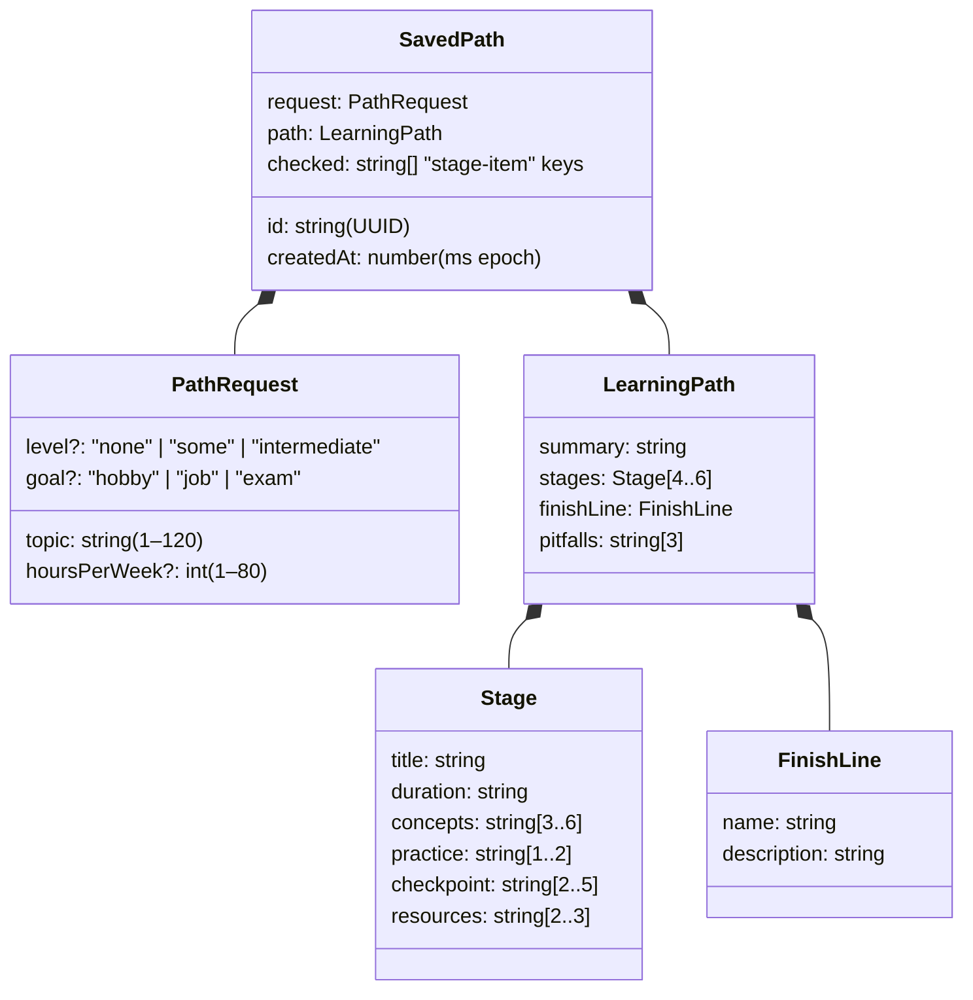
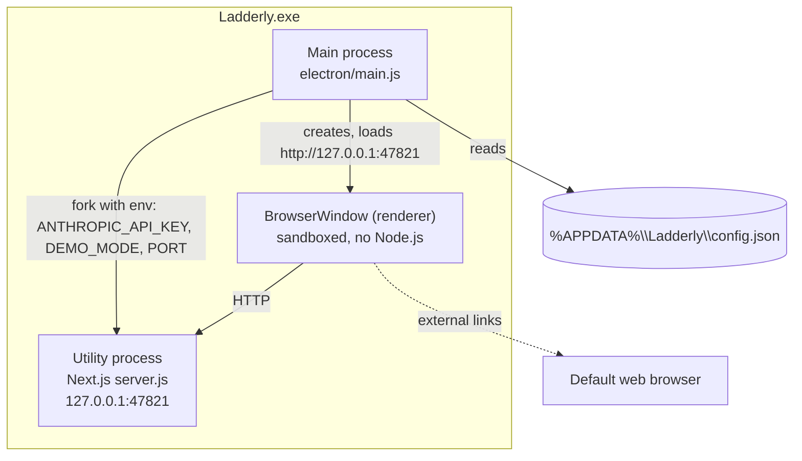
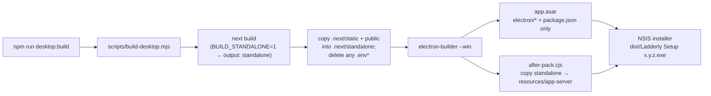

# Ladderly: Architecture and Design

This document explains how Ladderly is built and why. For *what* it must do, see [requirements.md](requirements.md).

## 1. Overview

Ladderly is a single Next.js application that runs in three ways:

| Mode | How it runs | API key | Typical use |
|---|---|---|---|
| **Web** | Deployed on Vercel | None, so demo mode | Public demo link |
| **Desktop** | Electron app that starts a bundled Next.js server on the user's PC | Optional, in a local settings file | Installed Windows app |
| **Development** | `npm run dev` | Optional, in `.env.local` | Building and testing |

All three share the same UI, API route, schema and demo data. Only the *host* differs.



## 2. Project structure

```
electron/            Desktop shell (Node.js, runs outside the browser)
  main.js            App lifecycle, window, menu
  server.js          Starts the bundled Next.js server and waits until it is ready
  config.js          Reads the desktop settings file (API key, demo mode)
scripts/
  build-desktop.mjs  Builds the standalone Next.js server and adds static files
  after-pack.cjs     electron-builder hook that copies the server into the packaged app
build/icon.svg       Logo source: a white ladder rising toward a yellow star on a dark grey tile (also src/app/icon.svg and components/Logo.tsx)
build/icon.png       App icon rendered from icon.svg (the installer and .exe icons are generated from it)
src/
  app/
    layout.tsx       HTML shell, fonts, no-flash theme script, demo banner
    page.tsx         The single page: state and layout
    api/path/route.ts  POST endpoint: validates, streams, calls Claude or serves demo data
  components/        Presentational React components (form, cards, panels, list…)
  lib/
    schema.ts        zod schemas and TypeScript types shared by client and server
    prompt.ts        System prompt and user-prompt builder
    demo.ts          Demo-mode switch and sample paths
    generate.ts      Browser-side client for the streaming API
    storage.ts       localStorage-backed store for saved paths
```

## 3. Request flow



### 3.1 Streaming protocol

`/api/path` responds with `application/x-ndjson`: one JSON object per line.

| Event | Shape | When |
|---|---|---|
| `delta` | `{ type: "delta", text: string }` | Each chunk of raw JSON text as it is generated |
| `done` | `{ type: "done", path: LearningPath }` | Once, after the full text is parsed and validated |
| `error` | `{ type: "error", message: string }` | Once, instead of `done`, if anything fails |

NDJSON was chosen over Server-Sent Events because it needs no extra library, works with a plain `fetch` stream reader, and keeps each event self-contained. The client ignores `delta` text for correctness. It only uses it for the live preview. The UI trusts the validated `done` payload alone.

## 4. Data model

Defined once with zod in `src/lib/schema.ts`. The TypeScript types are inferred from these schemas, so the types and validation can't drift apart.



Checkbox state is stored as keys like `"2-0"` (stage 3, item 1) from `checkKey()`. That keeps saved data small and independent of the checkpoint text.

## 5. Generation with Claude

- **SDK:** `@anthropic-ai/sdk`, `client.beta.messages.stream(...)`, on the server only.
- **Model:** `claude-opus-5` with `output_config.effort: "medium"`, which balances speed and quality for this short, structured task.
- **Structured output:** `output_config.format = betaZodOutputFormat(LearningPathSchema)`. The SDK turns the zod schema into a JSON Schema, so Claude must return JSON of that shape. Count limits the JSON Schema can't express (e.g. "4–6 stages") are passed to Claude as hints and **enforced by zod** after generation.
- **Refusal fallback:** `fallbacks: "default"` with beta `server-side-fallback-2026-07-01`. If a safety classifier declines, the API retries on Anthropic's recommended fallback model instead of failing.
- **Stop reasons:** `refusal` and `max_tokens` become user-friendly errors. Only `end_turn` output is parsed.
- **Prompting:** `SYSTEM_PROMPT` in `prompt.ts` sets the rules (testable checkpoints, no URLs, realistic durations). `buildUserPrompt()` adds the learner's details.

## 6. Demo mode

`isDemoMode()` in `demo.ts` is the single switch, evaluated on the server at request time:

| `DEMO_MODE` | `ANTHROPIC_API_KEY` | Result |
|---|---|---|
| `"true"` | any | Demo |
| anything else | missing or empty | **Demo** (fail-safe: no key means no paid calls) |
| anything else | set | Real generation |

Demo responses go through the same NDJSON stream, with small delays between chunks, and are validated with the same schema. That means the UI code has no demo-specific branches, apart from the banner.

`DemoBanner` is an async server component that calls `connection()`, so it is rendered **per request**, not at build time. This matters for the desktop app, which decides demo mode at launch, after the build.

## 7. Client state and persistence

- **Page state** (`page.tsx`): `status` (`idle` | `loading` + partial text | `error` + message), the last request (for Retry), the selected path ID, and an `AbortController` so a new request cancels the previous one.
- **Saved paths** (`storage.ts`): a small external store over `localStorage` key `ladderly:paths` (falling back once to `pathfinder:paths`, the key used before the rename), read through React's `useSyncExternalStore`. Entries are validated with zod on load, and invalid ones are dropped. `useSavedPaths()` returns `null` during server rendering, so the page can tell "not loaded yet" from "no paths".
- **Theme**: `localStorage` key `ladderly:theme` and a `.dark` class on `<html>`. An inline script in `layout.tsx` applies it before first paint, to avoid a flash of the wrong theme. `ThemeToggle` watches the class with a `MutationObserver`.

## 8. Desktop architecture (Electron)

### 8.1 Why a local server

The app needs server code: the API route that holds the key and calls Claude. Rather than rewrite it for Electron, the desktop app bundles the Next.js **standalone server** and runs it locally. This means:

- one codebase for web and desktop;
- the API key stays in a server process, never in the window (NFR-1);
- demo mode works fully offline.

### 8.2 Processes



### 8.3 Startup sequence

1. `requestSingleInstanceLock()`: a second launch focuses the existing window and exits.
2. `ensureConfigFile()` creates `config.json` (`{"anthropicApiKey": "", "demoMode": true}`) if it's missing.
3. `choosePort(47821)` uses the fixed port if it's free, otherwise any free port.
4. `startServer()` forks `server.js` as an Electron utility process, with env from `configToEnv()`, and `waitForServer()` polls until it answers (20 s timeout).
5. `createWindow()` loads the URL and shows the window when it's ready. If any step fails, an error dialog is shown and the app quits.
6. On quit, the server process is killed. If the server exits unexpectedly while the app is running, the app shows an error and quits.

**Why a fixed port:** `localStorage` is scoped to the page's origin, which includes the port. A fixed port keeps saved paths across launches. If 47821 is taken, the app still works, but that session uses separate storage.

### 8.4 Settings

`%APPDATA%\Ladderly\config.json`:

```json
{ "anthropicApiKey": "sk-ant-...", "demoMode": false }
```

Real generation is used only when a key is set **and** `demoMode` is `false`. Opened from **File → Open Settings File**, applied with **File → Restart to Apply Settings**.

### 8.5 Window security

- `contextIsolation: true`, `nodeIntegration: false`, `sandbox: true`, and no preload script: the page is an ordinary web page with no access to Node.js or the file system.
- `setWindowOpenHandler` and `will-navigate` keep the window on the local server. Other `http(s)` links open in the default browser.
- The server binds to `127.0.0.1`, so other devices on the network can't reach it.

### 8.6 Build and packaging



- `output: "standalone"` is enabled **only** for desktop builds (`BUILD_STANDALONE`), so Vercel builds are unaffected.
- `app.asar` excludes `node_modules`, because the main process uses only Electron and Node.js built-ins. The server's own trimmed `node_modules` travels inside `app-server`.
- The copy happens in an `afterPack` hook because electron-builder's `extraResources` skips `node_modules` and dot-folders such as `.next`.
- The installer is per-user (no admin rights needed), lets the user choose the folder, and creates Start menu and desktop shortcuts.

## 9. Error handling

| Failure | Where detected | User sees |
|---|---|---|
| Invalid input | `route.ts` (zod) | Message from the validator (HTTP 400) |
| Invalid API key | `describeError` | "The Anthropic API key is invalid…" |
| Rate limit | `describeError` | "Rate limited… wait a moment and retry." |
| Network down | `describeError` | "Couldn't reach the Anthropic API…" |
| Other API error | `describeError` | "The Anthropic API returned an error (status)…" |
| Refusal | `stop_reason` | "Claude declined… try rephrasing." |
| Output cut off | `stop_reason === "max_tokens"` | "The response was cut off… retry." |
| Bad or invalid JSON | zod `safeParse` | "…unexpected format. Please retry." |
| Stream closed early | `generate.ts` | "The connection closed before the path was finished…" |
| Desktop server fails to start | `main.js` | Error dialog, app quits |

Every UI error shows **Retry**, which re-sends the last request.

## 10. Security summary

- The key lives in `.env.local` (development), Vercel environment variables (not set, by design) or `config.json` (desktop). It is read only by server code.
- `.gitignore` excludes `.env*` except `.env.example`, which holds no key. The desktop build deletes `.env*` from the bundle in two places.
- The web deployment has no key, so the public endpoint can't spend money.
- Model output is treated as data: validated with zod and rendered as text by React (no HTML injection).

## 11. Design decisions

| Decision | Alternatives considered | Reason |
|---|---|---|
| Bundle the Next.js server in Electron | Load the Vercel URL; rewrite as a static app | Works offline, keeps the key out of the window, single codebase |
| NDJSON streaming | Server-Sent Events; no streaming | Simple, no dependencies, live preview |
| zod as the single source of truth | Hand-written JSON Schema and types | One definition drives the prompt schema, validation and TypeScript types |
| Demo mode on when no key | Explicit flag only | Fail-safe against accidental API costs |
| localStorage | Database / accounts | No backend state needed. Private to the device |
| `useSyncExternalStore` for storage | `useEffect` + `useState` | Correct hydration and no cascading renders |

## 12. Possible future work

- In-app settings screen instead of editing `config.json`
- Code signing and auto-update for the desktop app
- Export and import of saved paths
- macOS and Linux builds (Electron supports them. They need their own build machines)
- More hand-written demo topics
